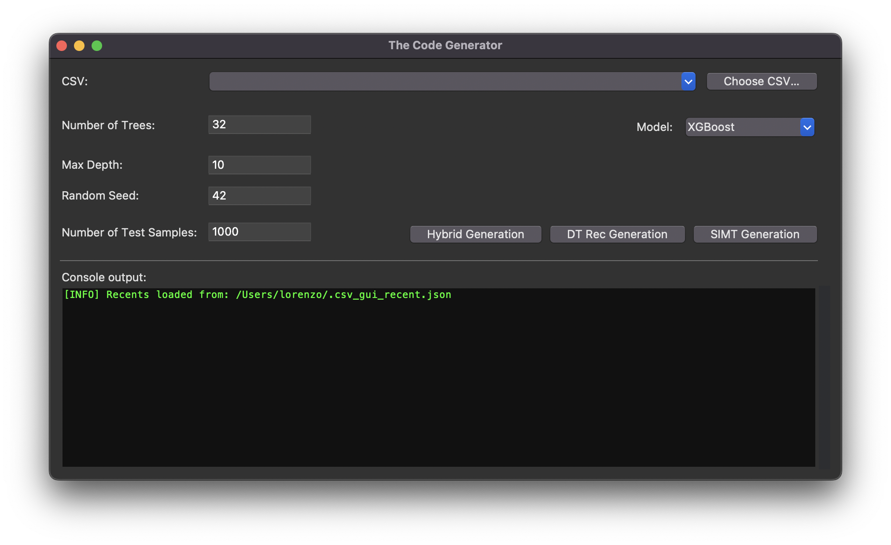

# The Hybrid Approach
> Tool implementing a hybrid approach for efficient decision-tree inference on embedded systems.

> **Note:** This repository was created to support the review of *On the Design of Decision Tree Visiting Kernels at the Edge*, but it is openly available and usable by the community.

## Overview
The Hybrid Approach is a strategy presented in the paper *On the Design of Decision Tree Visiting Kernels at the Edge*, designed for modern edge platforms equipped with cache hierarchies and tightly coupled memories (TCM).It relies on partitioning the original decision-tree-based model into two distinct sub-models, each mapped to a different memory region and executed using the kernel best suited to the characteristics of that memory.

Specifically, the sub-model allocated in TCM is executed using a Single Instruction Multiple Trees (SIMT) kernel, which enables parallel evaluation of multiple trees and fully exploits the low-latency and deterministic access of TCM.  
Conversely, the sub-model placed in Static Random Access Memory (SRAM) is executed using the DT-Rec kernel, a highly optimized and cache-friendly recursive implementation tailored for edge and resource-constrained scenarios.

This repository provides a tool that, starting from a dataset, generates C header code implementing this hybrid execution model, enabling efficient deployment of decision-tree inference on embedded systems.

## Key Features
- Implemented in Python and provided with a graphical user interface (GUI) for ease of use.
- Generates portable C code that can be directly included in embedded projects.
- Applies automatic quantization-aware training, converting input data and model parameters to a 16-bit fixed-point representation for efficient embedded execution.
- Uses a novel Single Instruction Multiple Trees (SIMT) approach that exploits ARM Helium vector extensions to parallelize decision-tree execution.
- Supports both Random Forest and XGBoost models, handling classification and regression tasks.
- Implements a hybrid execution strategy by partitioning the model across different memory regions (TCM and SRAM).
- Employs 5-fold cross-validation during model training to improve robustness and generalization.
- After training, models are exported in `joblib` format, enabling fast reuse and integration with separate workflows.

## Project Structure
The repository is organized as follows:
```text
├── Code_Generator/
│ ├── GUI/
│ │ └── gui.py # Main Python module providing the graphical user interface
│ ├── Kernels/
│ │ └── ... # Modules for kernel-specific C code generation
│ ├── Utils/
│   └── ... # Utilities for model training and preprocessing
│ 
├── Datasets/
│ └── ... # Example datasets for testing and experimentation
├── Examples/
│ └── ... # Example main codes and linker script
├── README.md
└── LICENSE
```

The `Code_Generator` directory contains the Python modules composing the core of the tool.  
The `GUI` subdirectory provides the main entry point for interacting with the tool through a graphical interface.  
The `Kernels` directory includes the modules responsible for generating C code for the supported execution kernels.  
The `Utils` directory contains utilities for model training, validation, and preprocessing.  

The `Datasets` directory provides example datasets that can be used to quickly test and evaluate the tool.

The `Example` directory provides example code snippets and linker script.

## Requirements

This section outlines the requirements needed to use the tool and to integrate the generated code.

### Tool Requirements

To run the code generation tool, the following requirements must be satisfied:

- **Python version:** Python 3.13.5  
- A standard Python environment capable of running scientific and machine learning libraries.
- A system supporting graphical user interfaces to run the provided GUI.

It is recommended to use a virtual environment to manage dependencies and ensure reproducibility.

The tool has been tested on macOS Sequoia 15.6 and Windows 10 Pro.

#### Python Standard Library
The following modules are part of the Python standard library and do not require additional installation:

- `os`
- `sys`
- `csv`
- `json`
- `re`
- `shutil`
- `threading`
- `traceback`
- `pathlib`
- `typing`
- `collections`
- `io`

#### External Python Dependencies
The following external libraries are required to run the tool:

- `numpy`
- `pandas`
- `scikit-learn`
- `xgboost`
- `scipy`
- `joblib`

All required external dependencies can be installed using `pip`:

```bash
pip install numpy pandas scikit-learn xgboost scipy joblib
```

#### GUI Support
The graphical user interface is implemented using `Tkinter`, which is included by default in most Python distributions.
If `Tkinter` is missing, it may need to be installed separately depending on the operating system.

### Generated Code Requirements

The generated code is provided as a C header file and can be included in any embedded C project.

To correctly compile and execute the generated code, the following requirements must be satisfied:

- A target platform based on an **ARM processor**.
- Support for **ARM Helium vector extensions**, as the code relies on a SIMD-based execution model.
- Compilation using an **ARM bare-metal toolchain**, such as `arm-none-eabi-gcc`.
- A memory architecture featuring **Static RAM (SRAM)** and an **L1 data cache**.
- Availability of **Tightly Coupled Memories (TCM)** to enable low-latency and deterministic execution of the parallel kernel.

No operating system is required, and the generated code can be integrated into bare-metal projects.

## Usage

### Tool Usage
To start the tool, launch the graphical user interface by running the following command from the project root:

```bash
python3 -m Code_Generator.GUI.gui
```
The following graphical user interface will be displayed:



From the GUI, the user can configure the following parameters:

- **Dataset selection:** Datasets can be selected using the *Choose CSV* button. The tool stores the most recently used datasets and automatically generates the corresponding `joblib` files in the same directory.
- **Model:** The model type can be selected between Random Forest and XGBoost.
- **Number of trees:** The number of trees used for both Random Forest and XGBoost models can be configured. A number of multiple of 8 must be used.
- **Maximum depth:** The maximum tree depth parameter is applied only to Random Forest models.
- **Random seed:** A random seed can be specified to ensure reproducibility of the training process.
- **Number of test samples:** The number of test samples extracted from the dataset.
- **Code generation:** The *Hybrid*, *DT-Rec*, and *SIMT* generation buttons allow launching the generation of the corresponding execution approaches. 

### Generated Code Usage

The generated C code must be imported into the target embedded project and included in the main application source file.  
All required headers and dependencies needed for execution are automatically included by the generated code.

To correctly place the generated data structures, it is necessary to initialize the appropriate memory regions in the linker script.  
An example linker script configuration is provided in the repository and can be used as a reference:

> **Linker script example:** `path/to/linker_script_example.ld`

#### Available Functions

The generated code exposes the following functions, which can be called directly from the application:

- `inference(int16_t* sample)`  
  Performs inference on a single input sample using the **Hybrid approach**.  
  This function should be used when the model size exceeds the total available DTCM memory.

- `inference_RAM(int16_t* sample)`  
  Performs inference using only the portion of the model allocated in **RAM**.  
  This function is available only when using **SIMT** or **DT-Rec**, and when the generated model fits entirely within the DTCM memory constraints.

- `inference_DTCM(int16_t* sample)`  
  Performs inference using only the portion of the model allocated in **DTCM**.  
  This function is available only when using **SIMT** or **DT-Rec**, and when the generated model fits entirely within the DTCM memory constraints.

- `init_dtrec()`  
  Initializes the data structures required by the **DT-Rec** kernel when it is enabled.

- `init_dtrec_ram()`  
  Initializes the **DT-Rec** data structures allocated in RAM.

- `init_dtrec_dtcm()`  
  Initializes the **DT-Rec** data structures allocated in DTCM.

#### Output Data

Inference results are stored in the following output arrays:

- `final_results` for the **SIMT** execution model
- `out` for the **DT-Rec** execution model

### Examples

The repository includes an `Examples` directory containing code snippets that demonstrate how to integrate and use the generated code.

These examples provide ready-to-use portions of code for:
- Initializing the required memory regions and data structures.
- Calling the appropriate initialization functions depending on the selected execution model.
- Help performing inference using the Hybrid, SIMT-only, or DT-Rec-only approaches.
- Accessing and interpreting the inference output results.
- Showing how performance are taken from inference.

The provided examples are intended to simplify integration and can be directly adapted to specific embedded projects.

## License
This project is licensed under the **GNU General Public License v3.0 (GPLv3)**.

For more details, see the `LICENSE` file included in this repository.


